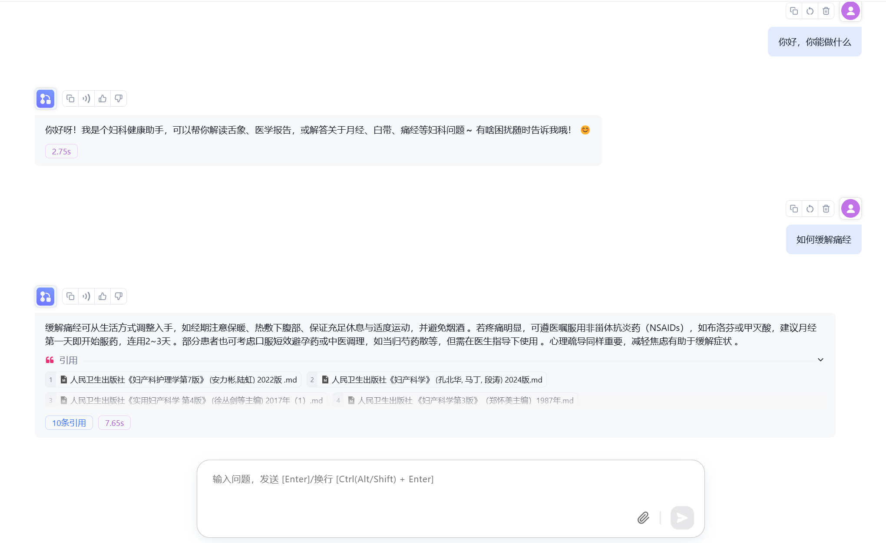
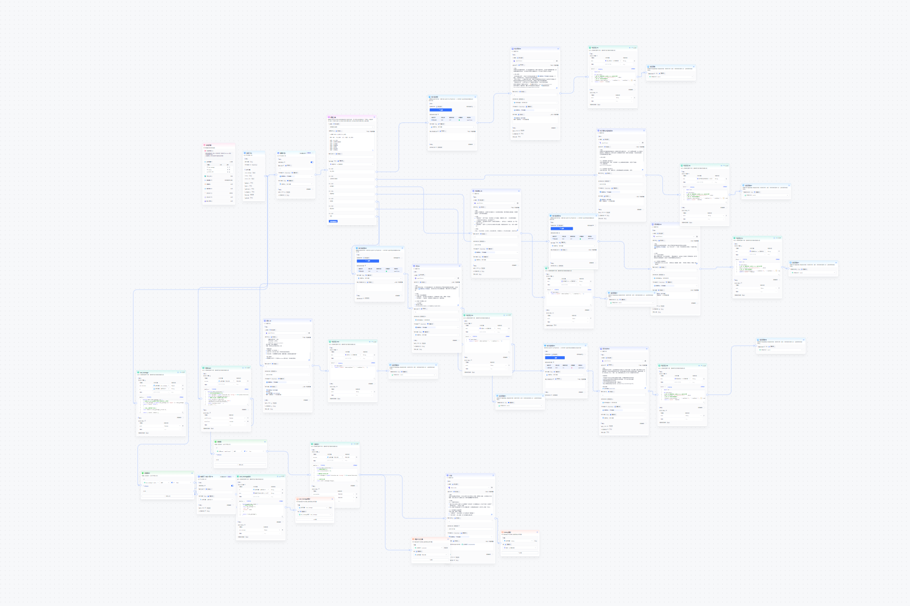

# 医生智能助手

> *基于 FastGPT 工作流的多专科 AI 医疗咨询系统*

## 项目简介

为多位不同专科医生定制开发的 AI 智能助手，通过 FastGPT 工作流实现 7×24 小时自动回复患者咨询。系统能够处理医学问答、挂号指引、购药引导等常见需求，并通过 API 接口集成到企业微信平台，实现自动化患者服务。

## 核心技术

- **FastGPT** - 工作流编排与对话管理
- **RAG（检索增强生成）** - 基于医学知识库的精准回答
- **意图识别** - 准确理解患者咨询意图
- **知识库构建** - 医学知识整理与向量化
- **API 集成** - 与企业微信深度对接
- **多轮对话管理** - 支持复杂场景的连续对话

## 我的工作

- ✅ 独立完成需求分析，梳理各专科医生的服务场景
- ✅ 设计 FastGPT 工作流，实现多分支对话逻辑
- ✅ 整理医学知识库并完成向量化处理
- ✅ 对接企业微信 API，实现消息自动回复
- ✅ 测试调优，提升回答准确率与用户体验

## 项目亮点

### 1. 多专科定制化

为每位医生单独定制工作流和知识库，确保专业性和准确性：

- 不同专科有不同的知识体系和服务流程
- 针对性的意图识别和回答策略
- 灵活适配医生的个人工作习惯

### 2. 企业微信集成

通过 API 接口将 AI 助手接入企业微信：

- 患者通过企业微信直接咨询
- 自动回复常见咨询，减轻医生工作负担
- 7×24 小时不间断服务

### 3. 完整的 RAG 流程

- 医学文档整理与清洗
- 知识库向量化存储
- 检索增强生成，确保回答有据可查

## 在线体验

以下是部分医生的 AI 助手体验链接：

- [医生A 智能助手](http://114.55.140.84:3000/chat/share?shareId=n4R4kq8RvOX4SlesYAiz24I6)
- [医生B 智能助手](http://114.55.140.84:3000/chat/share?shareId=x5ubK2jTYEAiylqyyrnQ1xau)
- [医生C 智能助手](http://114.55.140.84:3000/chat/share?shareId=ssPea0cfK8txAusg5iTKC5hN)
- [医生D 智能助手](http://114.55.140.84:3000/chat/share?shareId=qwAd7BTXVFeg45cb5dVPkRV0)

---

> 💡 注：以上为体验链接，实际部署已集成至企业微信平台。
