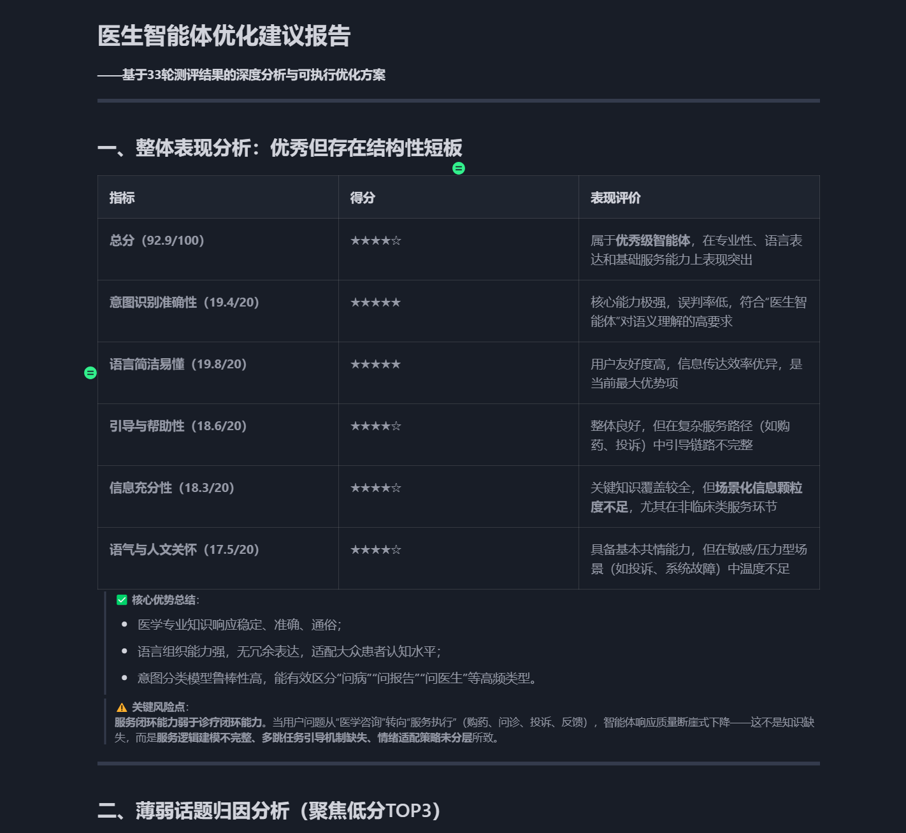
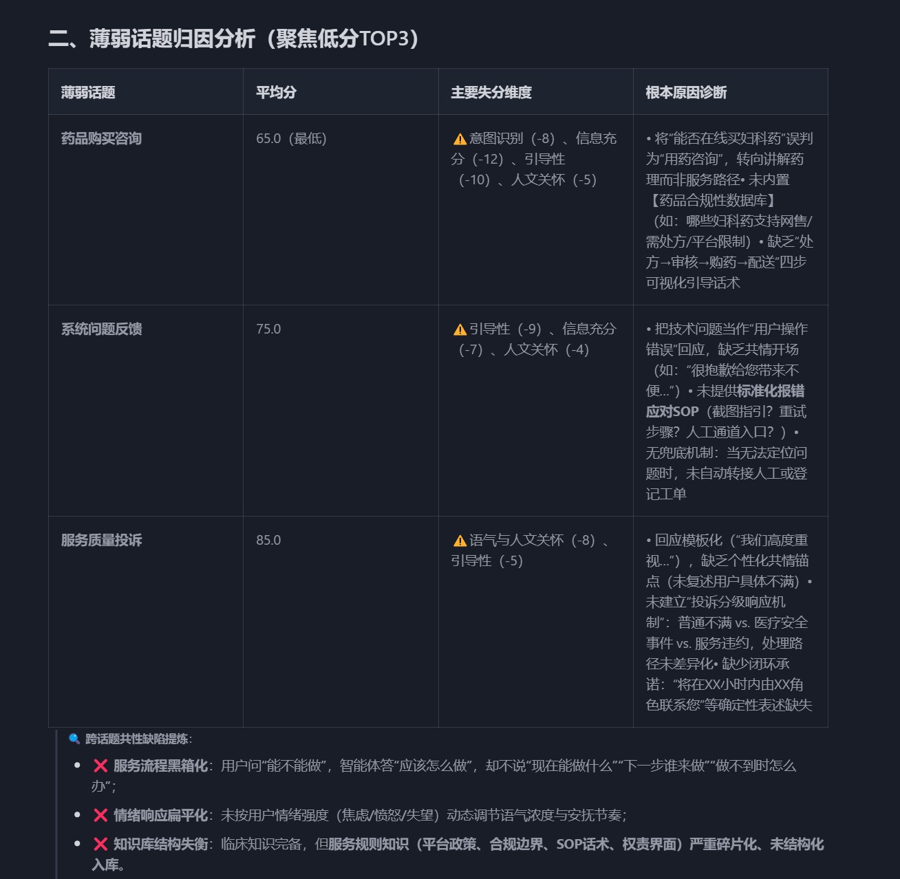

# 🧪 FastGPT Agent Tester

> **让智能体迭代从"玄学"走向"科学"**
> 
> 专为 FastGPT 智能体设计的自动化测评框架，从「人工逐条验证」迈向「全自动化评估」。

  
  
  
  
  

---

## 🏗️ 项目简介

FastGPT Agent Tester 是一款专为 FastGPT 智能体设计的自动化测评框架，通过"用户智能体"模拟真实对话，并由"裁判智能体"基于多维度指标进行量化打分，实现批量测试 → 智能评分 → 优化建议的自动化测评闭环。

---

## ❌ 传统测试 vs ✅ 自动化测评

为什么需要自动化测评框架？

<strong>⚡ 效率对比</strong>

<ul>
<li>传统：逐条对话，耗时耗力</li>
<li><strong>Agent Tester</strong>：批量运行，一夜完成百轮测试</li>
</ul>

<strong>📏 标准对比</strong>

<ul>
<li>传统：主观判断，因人而异</li>
<li><strong>Agent Tester</strong>：统一标尺，多维度客观量化</li>
</ul>

<strong>💰 成本对比</strong>

<ul>
<li>传统：研发人力反复投入</li>
<li><strong>Agent Tester</strong>：一次编写，永久复用</li>
</ul>

<strong>🎯 反馈对比</strong>

<ul>
<li>传统：口头建议，难以落地</li>
<li><strong>Agent Tester</strong>：结构化报告，直接指导优化</li>
</ul>

<strong>🔍 覆盖对比</strong>

<ul>
<li>传统：抽样验证，容易遗漏</li>
<li><strong>Agent Tester</strong>：全场景覆盖，问题无所遁形</li>
</ul>

---

## 🔧 核心技术栈

---

## ✨ 核心特性

### 🤖 自动化双模对弈
基于大模型模拟真实用户提问，支持复杂的多轮对话上下文。

### 📊 多维度量化评分
引入 Judge Agent，支持自定义评分标准（针对性、信息量、语气同理心等）。

### 📝 Markdown 驱动配置
无需修改代码，仅需编写 Markdown 文档即可定义测试方案。

### 📑 深度报告生成
自动生成测评报告，直观展示各话题的表现差异与薄弱点。

### 🎯 智能优化闭环
基于评估结果自动生成 Prompt 优化建议，辅助开发者快速迭代。

---

## 📊 效果展示

*测评报告概览*

*多维度评分详情*

---

## 🏛️ 技术架构

  

    
📄 配置文件

    
→

    
👤 用户智能体

    
→

    
⚡ FastGPT API

    
→

    
⚖️ 裁判智能体

  

  

    
💡 优化建议

    
←

    
📊 测评结果汇总

    
←───────────┘

  

- **Loader**：解析 Markdown 配置，初始化任务队列
- **User Agent**：模拟不同背景的用户发起咨询
- **FastGPT Client**：高性能异步客户端，支持多轮对话状态维护
- **Judge Agent**：依据配置的评分标准进行客观打分
- **Optimizer**：汇总缺陷模式，输出优化策略

---

## 🔗 项目链接

- **GitHub 仓库**：[https://github.com/G-LJH/FastGPT-Agent-Tester](https://github.com/G-LJH/FastGPT-Agent-Tester)
- **完整文档**：查看仓库中的 README.md
